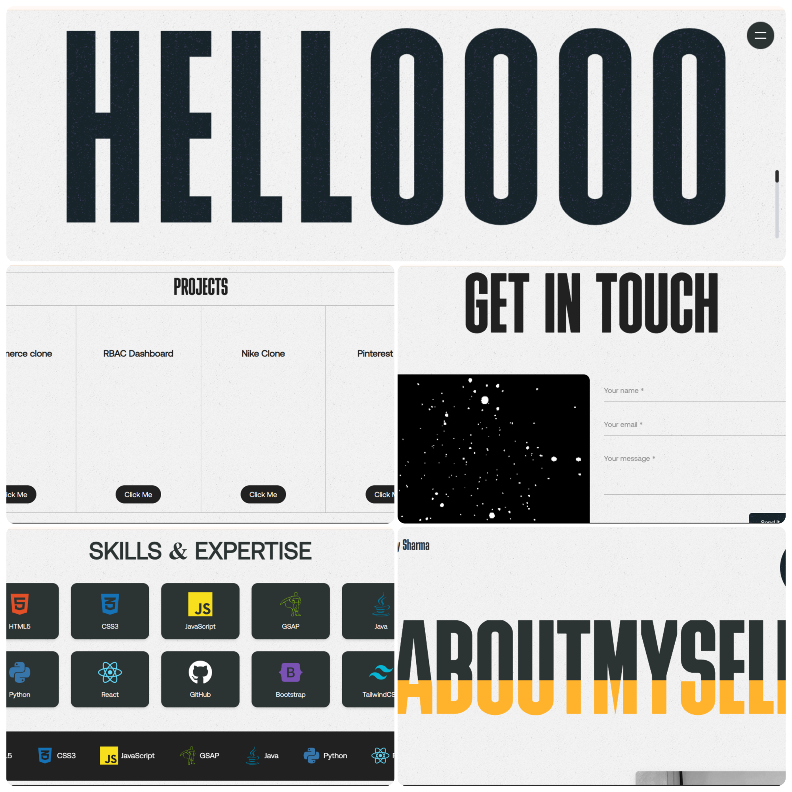

# Portfolio 1.0

This is my personal portfolio website, showcasing my skills and projects as a frontend developer.

## Table of Contents
- [About](#about)
- [Features](#features)
- [Technologies Used](#technologies-used)
- [Contact](#contact)

## About
This portfolio is designed to provide a clear and engaging overview of my experience and abilities in frontend development. It includes examples of my work, information about my skills, and ways to contact me.

## Features
- **Responsive Design:** The portfolio is fully responsive and looks great on all devices.
- **Interactive Elements:** Smooth animations and interactive components enhance the user experience.
- **Project Showcase:** Descriptions and links to my projects.
- **About Me Section:** Information about my background, skills, and experience.
- **Contact Information:** Easy ways to get in touch with me.

## Technologies Used
- **React.js:** For building the user interface and component-based architecture.
- **GSAP (GreenSock Animation Platform):** For smooth animations.
- **Three.js:** For creating interactive 3D particles on the contact page.
- **Routing:** React-Router Used for client-side routing and navigation.
- **HTML5, CSS3, JavaScript:** Core web technologies.
- **Vite:** Used as the build tool for fast development.

## Contact
- **Email:** vinaysharma511511@gmail.com
- **LinkedIn:** https://www.linkedin.com/feed/
- **GitHub:** https://github.com/87vinay
